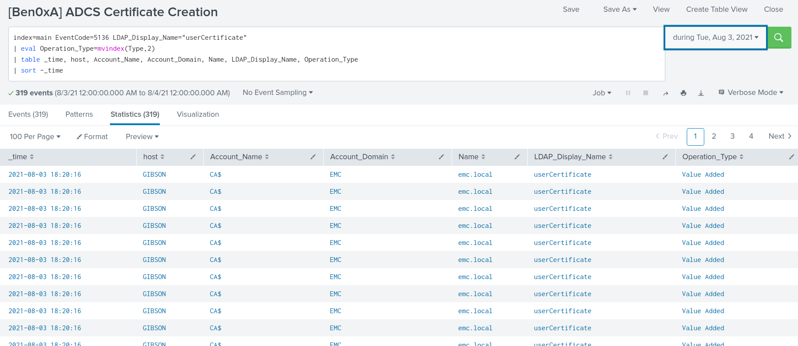
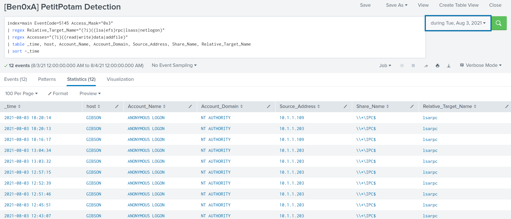

# Random_Splunk_Detections
#### Written by Ben0xA (@ben0xa)
PSA: These are based off of my lab and I haven't had a chance to test in a production environment.

Feel free to use, but always appreciate the attribution. Sharing is caring.

## Active Directory Certificate Services - New Certificate Created
#### Splunk Query
```
index=main EventCode=5136 LDAP_Display_Name="userCertificate"
| eval Operation_Type=mvindex(Type,2)
| table _time, host, Account_Name, Account_Domain, Name, LDAP_Display_Name, Operation_Type
| sort -_time
```
#### Screenshot

#### Direct Link
[ADCS_Detection.md](ADCS_Splunk_Detection.md)

## PetitPotam - IPC$ Share Access Detection
#### Splunk Query
```
index=main EventCode=5145 Access_Mask="0x3"
| regex Relative_Target_Name="(?i)((lsa|efs)rpc|lsass|netlogon)"
| regex Accesses="(?i)((read|write)data|addfile)"
| table _time, host, Account_Name, Account_Domain, Source_Address, Share_Name, Relative_Target_Name
| sort -_time
```
#### Screenshot

#### Direct Link
[PetitPotam_Detection.md](PetitPotam_Detection.md)
